# 📺 TV Hub

> **A modern TV show dashboard to demo production-ready DevOps practices**

[](https://github.com/navillasa/tv-dashboard-k8s/actions)
[](./infra/)
[](./backend/Dockerfile)


*Live dashboard showing popular shows across Netflix, Disney+, Prime Video, and more streaming platforms*

A comprehensive TV show aggregation platform built to demonstrate enterprise-level DevOps engineering practices. While the application itself is intentionally simple (displaying trending TV shows from multiple platforms), the infrastructure and deployment pipeline showcase advanced concepts including GitOps, observability, security, and cloud-native architecture patterns.

---

## 🌟 **Infra Highlights**

- **Base Infrastructure**: Terraform on GKE Autopilot with managed SSL/DNS
- **GitOps deployment**: ArgoCD with dev auto-sync + manual prod promotion
- **Security**: HashiCorp Vault + External Secrets Operator
- **Performance**: Instant loading, cached images, progressive enhancement
- **Observability stack**: Prometheus metrics + custom Grafana dashboards

---

## ✨🖥️ **DevOps Technology Stack & Practices**

This project demonstrates enterprise-level DevOps practices using modern tooling:

### 1. **Infrastructure as Code (Terraform)**
- **GKE Autopilot Provisioning**: Complete infrastructure defined in code
- **Network Configuration**: Auto-managed VPC, subnets, and firewall rules
- **DNS Management**: Automated domain and subdomain setup
- **Resource Optimization**: Cost-effective, right-sized infrastructure
- **[View Terraform Code](./infra/)**

### 2. **GitOps & Continuous Delivery**
- **ArgoCD Implementation**: Complete GitOps workflow with environment promotion
- **Multi-Environment Strategy**: Separate dev and prod environments with consistent configurations
- **Kustomize Overlays**: Environment-specific customization with shared base resources
- **Deployment Promotion**: Environment promotion pipeline with manual approval gates for production releases

- **[View GitOps Setup](./k8s-gitops/)**

### 3. **CI/CD Pipeline (GitHub Actions)**
- **Automated Workflows**: Build, test, and deploy on every commit
- **Multi-stage Testing**: Static analysis, unit tests, and integration tests
- **Semantic Versioning**: Automated version generation for traceability
- **Container Security**: Image scanning and validation
- **[View CI/CD Pipeline](./.github/workflows/ci.yml)**

### 4. **Secrets Management & Security**
- **HashiCorp Vault**: Central secrets management with auto-unseal
- **External Secrets Operator**: Kubernetes integration for secure secret synchronization
- **Secret Rotation**: Automated credential lifecycle management
- **Service Account Isolation**: Principle of least privilege implementation
- **[View Security Implementation](./k8s-gitops/base/vault/)**

### 5. **Observability Stack**
- **Prometheus & Grafana**: Metrics collection & data visualization deployed via GitOps
- **Custom Business Metrics**: Infrastructure and application metrics including platform popularity, API performance, user activity
- **Grafana Dashboards**: Public monitoring dashboard with business intelligence
- **Performance Analytics**: Response time and memory/CPU utilization monitoring

---

## 🌐 **Live Application Access**

### 📱 **TV Hub Dashboard** 
- **URL**: [http://tv-hub.navillasa.dev](http://tv-hub.navillasa.dev)
- **Features**: Multi-platform TV show aggregation with trending rankings
- **Multi-platform aggregation**: TMDB + TVMaze APIs with deduplication & real-time updates
- **UI**: Responsive React frontend with platform filtering and detailed modals

### 📊 **Live Business Intelligence Dashboard**
- **URL**: [TV Hub Business Intelligence Dashboard](https://monitoring.navillasa.dev/d/e633cf5f-2c8b-483b-90a1-aaa85bddd4d9/tv-hub-business-intelligence-dashboard?orgId=1&refresh=15s)
- **Features**: Comprehensive business analytics and production monitoring
- **Analytics**: Platform-specific popularity rankings, real-time user activity, API performance metrics
- **Security**: Attack detection, system resource monitoring, response time analysis
- **Business Insights**: E.g. "Netflix leads with 37 requests, 4,284+ total API calls, 100% API success rate"


*Interactive dashboard showing streaming platform analytics and production metrics*

### 🚀 **Automated Deployment Pipeline**
- **CI/CD Flow**: `git push → GitHub Actions → Container Registry → ArgoCD → Kubernetes`
- **Development**: Auto-deploys every successful build from main branch within 5-10 minutes
- **Production**: Manual promotion via `./scripts/promote-to-prod.sh <version>` after dev testing
- **Versioning**: Date-based semantic tags (e.g., `v20250819-abc123`) for clear traceability
- **Safety**: Comprehensive test suite + manual production gate prevents untested deployments

---

## 🏗️ **Architecture Overview**

### 🎯 **Application Architecture**
```
┌──────────────────┐    ┌─────────────────┐    ┌─────────────────┐
│   React Frontend │    │ Node.js Backend │    │   PostgreSQL    │
│   (Nginx)        │◄──►│  (Express API)  │◄──►│   Database      │
│   Port: 80       │    │  Port: 4000     │    │   Port: 5432    │
└──────────────────┘    └─────────────────┘    └─────────────────┘
          │                       │                       │
          └───────────────────────┼───────────────────────┘
                                  │
                     ┌─────────────────┐
                     │  External APIs  │
                     │  • TMDB         │
                     │  • TVmaze       │ 
                     └─────────────────┘
```

### ☸️ **Infrastructure Architecture**

```mermaid
graph TB
    subgraph "🌐 External Access"
        Users[👥 Users]
        DNS[🌍 Cloud DNS<br/>navillasa.dev]
    end
    
    subgraph "🔒 Security Layer"
        Ingress[⚡ GKE Ingress<br/>Load Balancer]
        Certs[🔐 Managed SSL<br/>Certificates]
    end
    
    subgraph "☸️ GKE Autopilot Cluster"
        subgraph "📦 tv-dashboard-dev"
            DevFE[🎨 Frontend<br/>React/Nginx]
            DevBE[⚙️ Backend<br/>Node.js API]
            DevDB[🗄️ PostgreSQL<br/>Database]
        end
        
        subgraph "📦 tv-dashboard-prod"
            ProdFE[🎨 Frontend<br/>React/Nginx]
            ProdBE[⚙️ Backend<br/>Node.js API]
            ProdDB[🗄️ PostgreSQL<br/>Database]
        end
        
        subgraph "📊 monitoring"
            Grafana[📈 Grafana<br/>Dashboards]
            Prometheus[📊 Prometheus<br/>Metrics]
        end
        
        subgraph "🔐 vault-system"
            Vault[🏦 HashiCorp Vault<br/>Secrets Engine]
            ESO[🔑 External Secrets<br/>Operator]
        end
        
        subgraph "🚀 argocd"
            ArgoCD[🔄 ArgoCD<br/>GitOps]
            ArgoDash[🎛️ ArgoCD UI]
        end
    end
    
    subgraph "📱 GitOps Repository"
        GitRepo[📝 GitHub Repo<br/>k8s-gitops/]
        Manifests[📋 K8s Manifests<br/>base/ + overlays/]
    end
    
    subgraph "🏗️ CI/CD Pipeline"
        Actions[⚙️ GitHub Actions<br/>Build & Test]
        GCR[📦 Google Container<br/>Registry]
    end
    
    subgraph "🌍 External APIs"
        TMDB[🎬 TMDB API<br/>Movie Database]
        TVMaze[📺 TVMaze API<br/>TV Shows]
    end
    
    %% User Flow
    Users --> DNS
    DNS --> Ingress
    Ingress --> Certs
    
    %% Application Flow
    Ingress --> DevFE
    Ingress --> ProdFE
    Ingress --> Grafana
    Ingress --> ArgoDash
    
    DevFE --> DevBE
    DevBE --> DevDB
    ProdFE --> ProdBE
    ProdBE --> ProdDB
    
    %% External API Integration
    DevBE --> TMDB
    DevBE --> TVMaze
    ProdBE --> TMDB
    ProdBE --> TVMaze
    
    %% Monitoring
    Prometheus --> DevBE
    Prometheus --> ProdBE
    Prometheus --> DevDB
    Prometheus --> ProdDB
    Grafana --> Prometheus
    
    %% Secrets Management
    Vault --> ESO
    ESO --> DevDB
    ESO --> ProdDB
    ESO --> DevBE
    ESO --> ProdBE
    
    %% GitOps Flow
    GitRepo --> ArgoCD
    Manifests --> ArgoCD
    ArgoCD --> DevFE
    ArgoCD --> DevBE
    ArgoCD --> DevDB
    ArgoCD --> ProdFE
    ArgoCD --> ProdBE
    ArgoCD --> ProdDB
    ArgoCD --> Vault
    ArgoCD --> Grafana
    ArgoCD --> Prometheus
    
    %% CI/CD Flow
    Actions --> GCR
    GCR --> GitRepo
    
    style Users fill:#e1f5fe
    style Vault fill:#fff3e0
    style ArgoCD fill:#f3e5f5
    style Grafana fill:#e8f5e8
    style Prometheus fill:#e8f5e8
```


### **Technology Stack**

| Layer | Technology | Purpose |
|-------|------------|---------|
| **Frontend** | React + TypeScript + Vite | Modern SPA with responsive design |
| **Backend** | Node.js + Express + TypeScript | RESTful API with data aggregation |
| **Database** | PostgreSQL | Persistent storage with ACID compliance |
| **Containerization** | Docker + Multi-stage builds | Optimized, secure container images |
| **Orchestration** | Kubernetes (GKE Autopilot) | Container orchestration and auto-scaling |
| **Infrastructure** | Terraform on GCP | Infrastructure as Code |
| **CI/CD** | GitHub Actions | Automated testing and deployment |
| **Monitoring** | Prometheus + Grafana | Observability and alerting |
| **Secrets** | HashiCorp Vault + External Secrets | Secure secrets management |
| **GitOps** | ArgoCD | Declarative deployments and promotion |
| **DNS/SSL** | Cloud DNS + Managed Certificates | Automatic HTTPS and domain management |

---

## 📁 **Project Structure**

```
tv-dashboard-k8s/
├── 🎨 frontend/              # React + TypeScript SPA
│   ├── src/App.tsx          # Main app with instant loading
│   ├── public/images/       # Optimized poster cache
│   ├── Dockerfile           # Multi-stage production build
│   └── nginx.conf           # Optimized serving config
├── ⚙️  backend/              # Node.js + Express API  
│   ├── src/
│   │   ├── clients/         # TMDB & TVMaze integrations
│   │   ├── services/        # Business logic & aggregation
│   │   ├── routes/          # REST API endpoints
│   │   ├── metrics.ts       # Prometheus metrics
│   │   └── db/              # Database operations
│   └── Dockerfile           # Optimized backend image
├── 🏗️  infra/                # Terraform Infrastructure as Code
│   ├── main.tf              # GKE Autopilot cluster
│   ├── variables.tf         # Environment configuration
│   └── kubeconfig.yaml      # Cluster access
├── ☸️  k8s-gitops/           # GitOps Kubernetes manifests
│   ├── base/                # Base configurations
│   │   ├── monitoring/      # Prometheus + Grafana stack
│   │   └── vault/           # HashiCorp Vault setup
│   ├── overlays/
│   │   ├── dev/             # Development environment
│   │   └── prod/            # Production environment
│   └── argocd/              # ArgoCD applications
├── 📊 monitoring/            # Dashboard configurations
│   └── tv-dashboard-grafana.json
├── 🔧 scripts/               # Automation scripts
│   ├── promote-to-prod.sh   # Production deployment
│   └── vault-auto-unseal.sh # Vault management
├── 🔄 .github/workflows/     # CI/CD pipeline
│   └── ci.yml               # Build, test, deploy automation
└── 🐳 docker-compose.yml     # Local development stack
```

---

## 🛠️ **Quick Start**

### **🌐 View Live Deployment**
- **Production**: [tv-hub.navillasa.dev](https://tv-hub.navillasa.dev) 
- **Monitoring**: [monitoring.navillasa.dev](https://monitoring.navillasa.dev/d/e633cf5f-2c8b-483b-90a1-aaa85bddd4d9/tv-hub-business-intelligence-dashboard?orgId=1&refresh=15s)

### **💻 Local Development**
```bash
# 1. Clone & Start
git clone https://github.com/navillasa/tv-dashboard-k8s.git
cd tv-dashboard-k8s
docker compose up -d

# 2. Access locally
open http://localhost:3000    # Frontend
open http://localhost:4000    # Backend API
```

### **☸️ Deploy to GKE**
```bash
# 1. Infrastructure (one-time setup)
cd infra && terraform apply

# 2. GitOps deployment via ArgoCD
# Pushes to 'main' branch auto-deploy to dev
# Production requires manual promotion:
./scripts/promote-to-prod.sh v20250819-abc123

# 3. Monitor deployment
kubectl get applications -n argocd
```

### **🔧 Prerequisites**
- Docker & Docker Compose (local dev)
- kubectl + gcloud CLI (deployment)
- GCP project with billing enabled

---

### **🚧 Future Enhancements**

#### **Performance & Scale**  
- [ ] Frontend performance optimization
- [ ] Redis caching layer for API response optimization
- [ ] Horizontal Pod Autoscaling based on demand
- [ ] Cost optimization dashboard

---

## 📊 **DevOps Metrics & KPIs**

This project demonstrates measurable DevOps improvements:

| Metric | Before | After | Improvement |
|--------|--------|-------|-------------|
| **Deployment Time** | Manual (30+ min) | Automated (3-5 min) | 85% faster |
| **Environment Consistency** | Manual setup | IaC + GitOps | 100% reproducible |
| **Security Posture** | Env file secrets | Vault integration | Enterprise-grade |
| **Monitoring Coverage** | None | Full observability | Complete visibility |

---

## 🧿 **Getting Started for Reviewers**

### **🌐 Live Applications** 
1. **TV Hub Production**: [tv-hub.navillasa.dev](http://tv-hub.navillasa.dev) - Full application
2. **Business Intelligence Dashboard**: [monitoring.navillasa.dev](https://monitoring.navillasa.dev/d/e633cf5f-2c8b-483b-90a1-aaa85bddd4d9/tv-hub-business-intelligence-dashboard?orgId=1&refresh=15s) - Real-time metrics

### **🔍 Technical Deep Dive**
3. **CI/CD Pipeline**: [GitHub Actions](https://github.com/navillasa/tv-dashboard-k8s/actions) - Automated build/test/deploy
4. **Infrastructure Code**: [Terraform configs](./infra/) - GKE Autopilot + managed services
5. **GitOps Manifests**: [Kubernetes YAML](./k8s-gitops/) - Multi-environment with Kustomize
6. **Monitoring Setup**: [Grafana dashboards](./k8s-gitops/base/monitoring/) - Custom business metrics

---

## 📞 **Contact**

- 📧 **Email**: navillasa.dev@gmail.com
- 💼 **LinkedIn**: [linkedin.com/in/natalievillasana](https://www.linkedin.com/in/natalievillasana)
- 🌐 **Portfolio**: [navillasa.dev](https://navillasa.dev)
